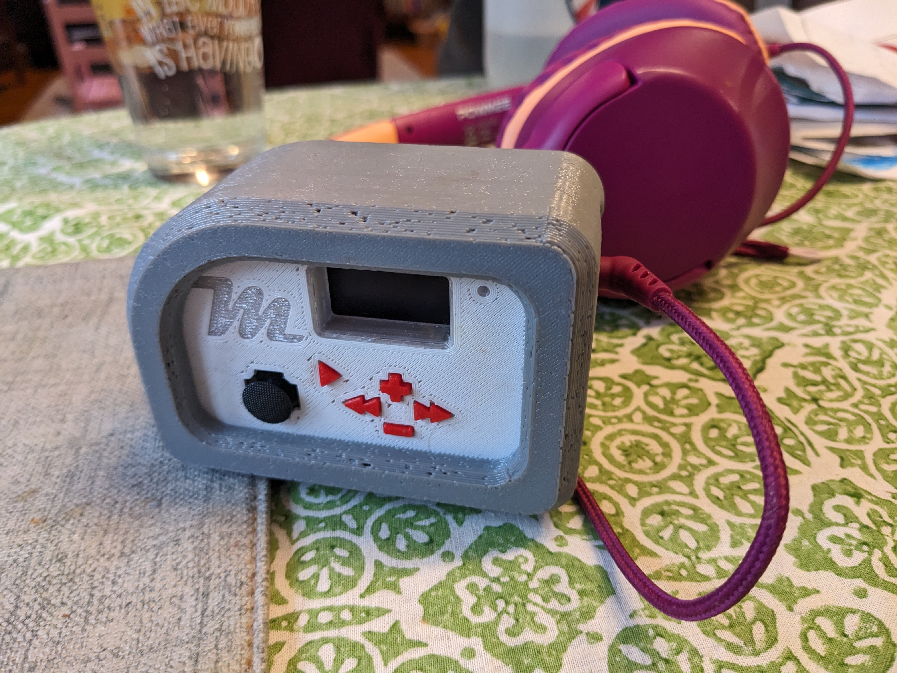

# Kids Audiobook Player

See also on Printables: https://printables.com/model/1088507-kids-audiobook-player-mp3-player

See images in "images" folder, and 3D geometry for print or modification in "3Dfiles""

**Uses adafruit feather components:**

ESP32: https://www.adafruit.com/product/5483
(would have maybe been better to choose a different feather for packaging! anyways, the 3D shape is made for this and it works...)

Joywing: https://www.adafruit.com/product/3632

MP3: https://www.adafruit.com/product/3357

and then also some simple slide switches and m2 heatset nut

Oh! and an 18650 slot and 18650 cell...

**Software intent, file prep and SD Card folder structure**

Behavior is good for kids: no words, easy controls.  No text: audio selection is all by cover images using the joystick and play/pause, skip, volume.  My kids got it quickly and like it. 

The file format, naming, and folder structure is strict:

1. you need to preprocess the file names and prep the audio 
   1. Audio: 128kbps mp3 nonvariable
   2. Art: 24bit .bmp 16bit, correct small size for screen is max 240x135
2. Folder structure is Series/book/chapter.mp3 (or Artist/album/track.mp3)
   1. Names need to be by number only, see below and in ExampleFolderStructure folder
3. Folder and File names: 
   1. audio files: 0000/0000/000.mp3 (001 to max track, in order no gaps)
   2. cover images: 0000/0000/cover.bmp
   3. scratch file for resume from last played: lastPlayed.txt

I use windows "Bulk Rename Utility" for the file naming, Paint for the art, and windows media player for the mp3 ripping...

**Compile and flash**

I used VSCode with the PlatformIO IDE extension.  Just open the folder in VSCode (or the kidsPlayer_Platformio.code-workspace) and PlatformIO is able to pull correct library dependancies and build for the ESP32 hardware (see platformio.ini file for definition) 

These boards should take a flash without any special button dance, but sometimes need the reset pushed when the "boot" button is held to get it into the bootloader.  See the note about bootloader [here](https://learn.adafruit.com/adafruit-esp32-s3-tft-feather/using-with-arduino-ide).  Unfortunately, the boot button is not easily available when it's all assembled (the hole in front is for the reset button) but it *is* possible to reach it with a bent paperclip slipped between the screen and the housing.  Do be careful not to crack the screen though...
