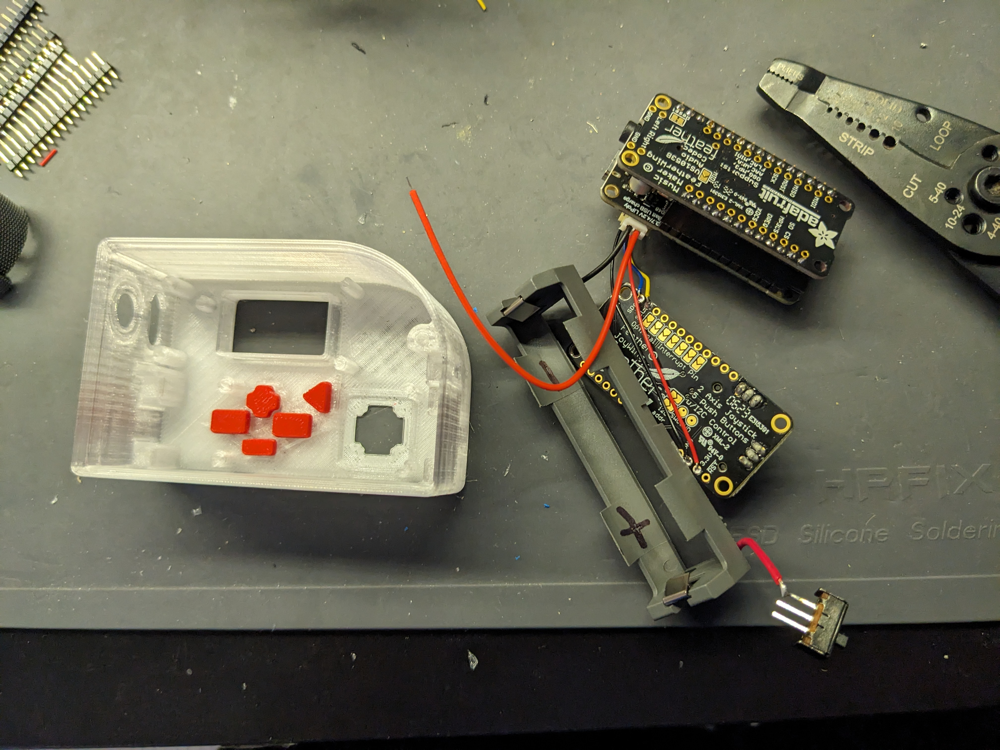
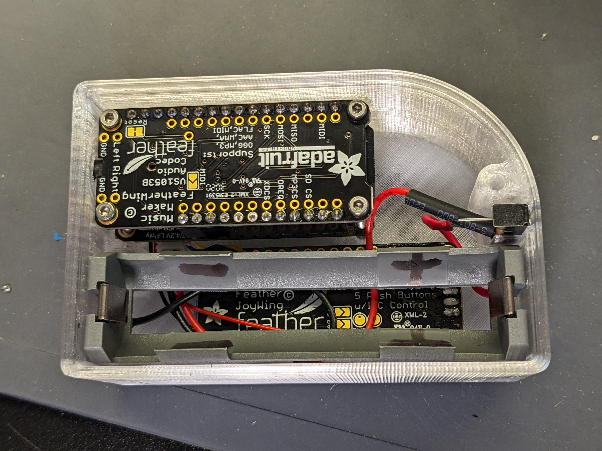
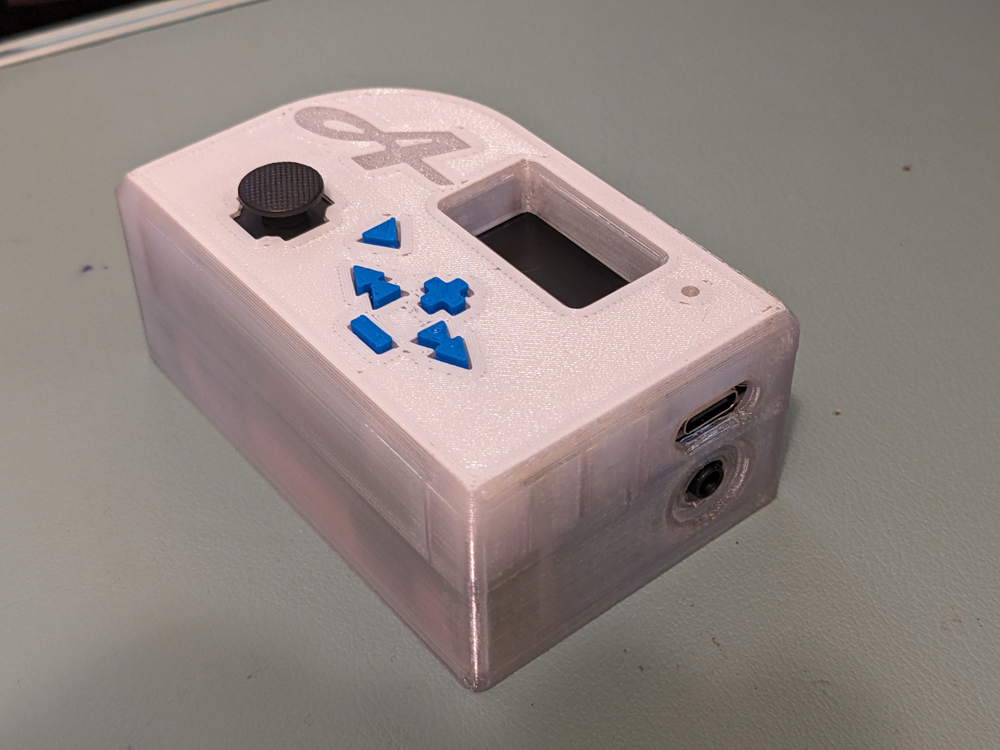

# Kids Audiobook Player Images

**Uses adafruit feather components:**

ESP32: https://www.adafruit.com/product/5483
(would have maybe been better to choose a different feather for packaging! anyways, the 3D shape is made for this and it works...)

Joywing: https://www.adafruit.com/product/3632

MP3: https://www.adafruit.com/product/3357

and then also some simple slide switches and m2 heatset nut

Oh! and an 18650 slot and 18650 cell...
